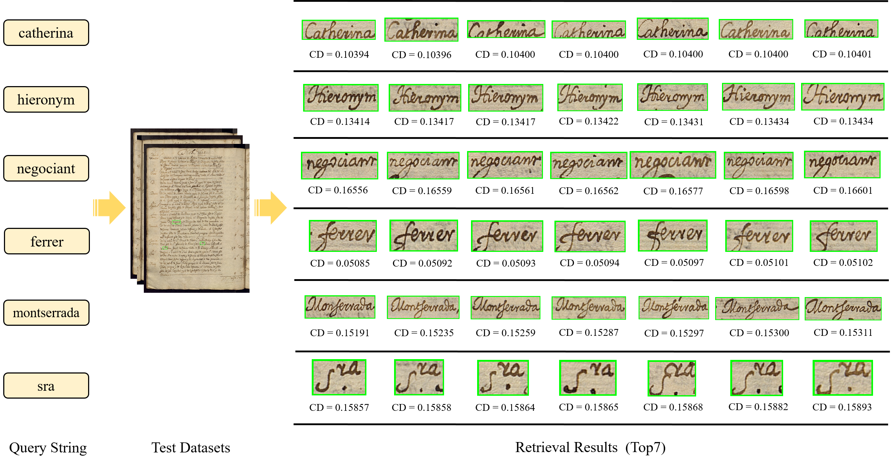

# Query By Strings and Return Ranking Word Regions with Only One Look
This is an implementation of paper "Query by Strings and Return Ranking Word Regions with Only One Look". The complete code will be provided soon. Please wait patiently!

## Requirements
* Python 3.5
* PyTorch v1.1.0
* shapely
* pillow
* opencv-python
* scipy
* tqdm
* scikit-image
* numpy
```
pip install -r requirements.txt
```

## Dataset preparation
1. Download the training, validation and testing dataset
    <p>The Konzilsprotokolle dataset can be downloaded from [ICFHR 2016 Handwritten Keyword Spotting Competition (H-KWS2016)](https://www.prhlt.upv.es/contests/icfhr2016-kws/data.html).</p>
    <p>The BH2M dataset can be downloaded from [IEHHR2017 competition](https://rrc.cvc.uab.es/?ch=10&com=downloads)</p>
2. Convert the downloaded dataset into the format we need
    ```
    python ./tools/tools_Konzilsprotokolle.py
    python ./tools/tools_BH2M.py
    ```
3. Augmenting training data offline
    ```
    python ./tools/tools_Konzilsprotokolle_docaug.py
    python ./tools/tools_BH2M_docaug.py
    ```

## Training
```
python train.py
```

## Testing
```
python predict.py
```
The cropped word images of the query and visual document images will be saved to `./output/~/QbS_word_res/` and `./output/~/QbS_res/` by default.

## Performance
The downloaded training models need to be put in `./output/` folder.
### BH2M
| Method | MAP(overlap=0.25) (%) | MAP(overlap=0.50) (%) | Model |
| - | - | - | - |
| ResNet50 + FPN | 95.30 | 95.09 | [baiduyun](https://pan.baidu.com/s/1HA07-K8NFzBsRXrG2_1K6A)(extract code: n0ax) |

## Results
<div align="center">
  
</div>
<p align="center">
  Fig. 1. The visualization results of several queries for the proposed method on BH2M. The figure shows the top 7 results starting from the left. The correct search results are highlighted in green. "CD" means the cosine distance between the predicted word embedding of the word area and the ground truth. The smaller the cosine distance, the greater the similarity.
</p>

## Citation
If you find our method useful for your reserach, please cite:

## Feedback
Suggestions and discussions are greatly welcome. Please contact the authors by sending email to 18120456@bjtu.edu.cn
